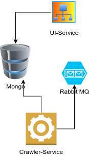

# Описание приложения

Приложение состоит из 4 компонентов:
* UI-Service  - Pithon  приложение
* Crawler-Service - Pithon  приложение
* Mongodb - БД, для хранения графа ссылок
* RabbitMQ - Очердь для  обработки ссылок 

