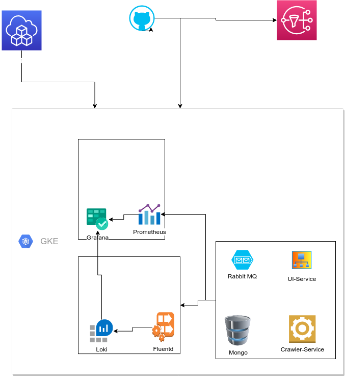

# Архитектура развертывания

Инфраструктура в GKE  разворачивается с помощью  Terraform:
* Создается кластер  Kubernetess - для простотоы из 1 ноды
* С помощью плагина helm_release накатываются  Helm  сценарии поддержки инфраструктуры
    * Nginx - Ingress контроллер
    * Prometheus сервер и экспортеры для RabbitMQ и MonogoDb
    * Grafana - для визуализации метрик и логов  (с "запеченными"  DataSource для Prometheus и Loki, а также кастомным дашбордом и некотрыми стандартными )
    * Fluentbit - для сбора логов с контейнеров и пересылки его в централизованное хранилище
    * Loki - для централизации логов  

Исходный код приложения  и инфраструктуры храниться на GitHub

CI\CD - организован  через GitHub Actions.
Существуют несколько Pipeline:  
* Тестрование кода - запускается при коммите в master
* Оценка покрытия кода юнит тестами - запускается при коммите в master
* Сборка проекта в контейнеры, отправка собранных контейнеров в Google Container Registry,  кастомизация манифестов развертывания приложния под  новые контейнеры и развертывание в созданном ранее  кластере GKE 

